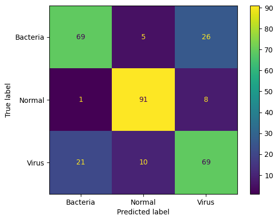
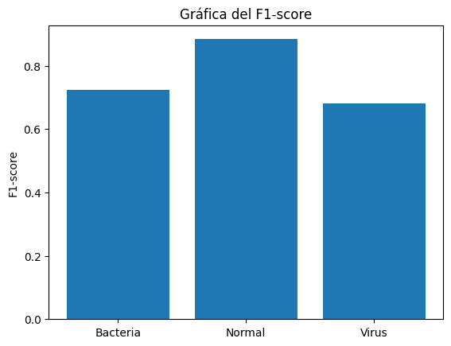
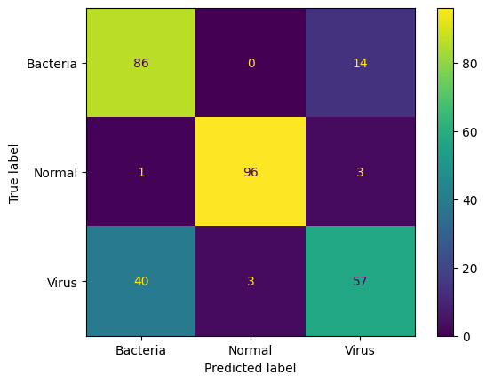
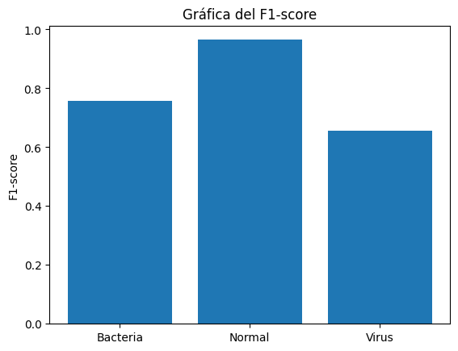

# Reporte del Modelo Final

## Resumen Ejecutivo

Durante la fase de experimentación, se entrenaron dos modelos de redes neuronales para abordar la tarea de clasificación de imágenes médicas relacionadas con bacterias, normales y virus. uno de estos modelos se baso en arquitectura convolucional estándar, mientras que el segundo utilizó la técnica de transfer learning.

## Descripción del Problema

**Descripción del Problema:**

El problema abordado con el modelo final se centra en la clasificación de imágenes médicas asociadas con tres categorías principales: bacterias, casos normales y virus. Esta tarea es esencial para el diagnóstico temprano y preciso de enfermedades infecciosas, permitiendo a los profesionales de la salud tomar decisiones fundamentadas y rápidas en el tratamiento de pacientes.

**Contexto del Problema:**

En el ámbito médico, la identificación de patrones visuales en imágenes es crucial para el diagnóstico y la toma de decisiones clínicas. En este caso, la clasificación de imágenes médicas específicas se realiza para distinguir entre diferentes tipos de infecciones, lo que puede tener un impacto significativo en la atención médica y en la gestión eficiente de recursos.

Las imágenes utilizadas en este contexto pueden incluir radiografías, escáneres u otros estudios de imágenes médicas que presentan características específicas asociadas con infecciones bacterianas, normales o virales. La capacidad de automatizar esta clasificación mediante modelos de aprendizaje profundo puede agilizar el proceso diagnóstico, mejorar la precisión y liberar tiempo para los profesionales de la salud.

**Objetivos del Modelo:**

Los objetivos fundamentales del modelo final son los siguientes:

* Precisión Diagnóstica: Proporcionar una herramienta de apoyo para la clasificación precisa de imágenes médicas, ayudando a identificar patrones que puedan ser difíciles de detectar a simple vista.

* Eficiencia en el Diagnóstico: Agilizar el proceso de diagnóstico al automatizar la clasificación de imágenes, permitiendo a los profesionales de la salud focalizar su atención en casos más complejos y decisiones clínicas críticas.

* Generalización: Desarrollar un modelo que pueda generalizar correctamente a nuevas imágenes, mejorando su utilidad en diferentes escenarios clínicos y tipos de datos.

**Justificación del Modelo:**

La implementación de un modelo de aprendizaje profundo se justifica por su capacidad para aprender patrones complejos y representaciones significativas de datos. El uso de redes neuronales convolucionales y transfer learning se fundamenta en la eficacia demostrada de estas arquitecturas en tareas de visión por computadora y clasificación de imágenes.

La necesidad de una herramienta precisa y eficiente para la clasificación de imágenes médicas motiva la elección de esta aproximación, ya que puede mejorar la velocidad y la exactitud del diagnóstico, contribuyendo así a la mejora de la atención médica y la toma de decisiones clínicas. La justificación se apoya en la promesa de que el modelo final puede ofrecer beneficios significativos en términos de precisión diagnóstica y eficiencia operativa en el entorno médico específico para el cual ha sido diseñado.

## Descripción del Modelo
### Modelo 1
Descripción del Modelo:

El modelo final diseñado para abordar el problema de clasificación de imágenes médicas se basa en una arquitectura de red neuronal convolucional (CNN) y se ha denominado "gonodactylus_simithii".

Metodología y Técnicas Utilizadas:

* Capa de Entrada:
    Se utiliza una capa de entrada con dimensiones (150, 150, 3), que corresponde al tamaño de las imágenes de entrada.

* Capas Convolucionales (CONV):
    Tres bloques de capas convolucionales, cada uno compuesto por dos capas CONV seguidas de una capa de agrupación máxima (MaxPooling). Estas capas extraen características clave de las imágenes mediante la aplicación de filtros convolucionales y reducen la dimensionalidad a través de la agrupación máxima.

* Aplanado (Flatten):
    Una capa de aplanado que convierte la salida de las capas convolucionales en un vector unidimensional. Este paso es esencial para conectar las capas convolucionales con las capas totalmente conectadas de la red neuronal.

* Red Neuronal Totalmente Conectada (Fully Connected):
    Dos capas totalmente conectadas (Dense) con funciones de activación ReLU, seguidas de capas de dropout para mitigar el riesgo de sobreajuste. La regularización L2 también se aplica para evitar el sobreajuste al introducir penalización en los pesos de la red.

* Capa de Salida:
    Una capa de salida con función de activación softmax, que clasifica las imágenes en una de las tres categorías definidas: bacterias, casos normales y virus.

* Compilación del Modelo:
    El modelo se compila utilizando el optimizador Adam, la función de pérdida categórica de entropía cruzada y se monitorea la precisión durante el entrenamiento.

* Resumen del Modelo:
    La estructura del modelo se resume utilizando la función summary() de Keras, proporcionando detalles sobre la arquitectura, el número de parámetros y las conexiones entre capas.

En resumen:

El modelo "gonodactylus_simithii" se ha diseñado para aprender patrones representativos en imágenes médicas, especialmente enfocado en la clasificación de casos relacionados con bacterias, normales y virus. La combinación de capas convolucionales para la extracción de características y capas totalmente conectadas para el aprendizaje de representaciones más abstractas permite una clasificación precisa y eficiente de las imágenes médicas. La implementación de técnicas como dropout y regularización L2 contribuye a la generalización del modelo y la mitigación del sobreajuste. Este enfoque integral tiene como objetivo proporcionar una herramienta efectiva para el diagnóstico automático en el contexto médico especificado.

###Modelo 2
Descripción del Modelo (Transfer Learning):

El segundo modelo desarrollado para resolver el problema de clasificación de imágenes médicas se basa en la técnica de transfer learning utilizando la arquitectura preentrenada VGG16.

**Metodología y Técnicas Utilizadas:**

* Extracción de Características (Transfer Learning):
    Se utiliza la arquitectura VGG16 preentrenada con pesos obtenidos de ImageNet como extractor de características. Las capas preentrenadas se congelan para aprovechar el conocimiento adquirido en tareas anteriores.

* Capa de Aplanado y Capas Totalmente Conectadas:
    Se agrega una capa de aplanado (Flatten) para convertir la salida de las capas preentrenadas en un vector unidimensional. Luego, se añaden dos capas totalmente conectadas (Dense) con funciones de activación ReLU y capas de dropout para evitar el sobreajuste.

* Capa de Salida:
    La capa de salida tiene una función de activación softmax, clasificando las imágenes en una de las tres categorías definidas: bacterias, casos normales y virus.

* Compilación del Modelo:
    El modelo se compila utilizando el optimizador Adam, la función de pérdida categórica de entropía cruzada y se monitorea la precisión durante el entrenamiento.

* Entrenamiento:
    El modelo se entrena utilizando los conjuntos de datos de entrenamiento y validación. Se emplea un conjunto de callbacks, incluyendo uno para guardar el mejor modelo según la métrica de validación y otro para detener el entrenamiento prematuramente si no hay mejoras significativas.

**En resumen:**

El modelo de transfer learning, denominado "transferLearning_model", se basa en la arquitectura VGG16 preentrenada, adaptada para la clasificación de imágenes médicas específicas. La estrategia de transfer learning permite beneficiarse de las capacidades de aprendizaje de características de VGG16 sin tener que entrenar desde cero. La inclusión de capas totalmente conectadas y técnicas de regularización busca mejorar la generalización y la capacidad de adaptarse a la tarea específica. Este modelo se presenta como una alternativa eficaz para la clasificación precisa de imágenes médicas en el contexto definido.

## Evaluación del Modelo
### Evaluación del Modelo 1 (Estandar):
El modelo estandar (Modelo 1) fue evaluado utilizando diversas métricas que proporcionan una comprensión detallada de su rendimiento en la tarea de clasificación de imágenes médicas.

| Métricas                | Valor                                            |
|------------------------|--------------------------------------------------|
| Accuracy (Precisión)   | 76%                                              |
| Recall (Exhaustividad) | Bacteria: 69%, Normal: 91%, Virus: 69%           |
| Precision (Precisión)   | Bacteria: 76%, Normal: 86%, Virus: 67%           |
| F1-Score (Puntuación F1)| Bacteria: 72%, Normal: 88%, Virus: 68% 

**Interpretación de Resultados:**

* Accuracy del Modelo:
El modelo tiene un accuracy del 76%, indicando que el 76% de las predicciones son correctas en el conjunto de prueba.
Recall:

* La exhaustividad (recall) destaca la capacidad del modelo para identificar correctamente cada clase. Se observa un rendimiento equilibrado en las clases Bacteria (69%), Normal (91%), y Virus (69%).

* Precision:
La precisión destaca la proporción de predicciones positivas que fueron correctas. Se observa un rendimiento consistente en la precisión para las clases Bacteria (76%), Normal (86%), y Virus (67%).

* F1-Score:
El F1-score, que combina precisión y recall, proporciona una medida equilibrada del rendimiento del modelo en cada clase. Se observa un buen equilibrio en las clases Bacteria (72%), Normal (88%), y Virus (68%).

**Matríz de Confusión**

**F1 Score**

### Evaluación del Modelo 2 (Transfer Learning):
El modelo de transfer learning (Modelo 2) fue evaluado utilizando diversas métricas que proporcionan una comprensión detallada de su rendimiento en la tarea de clasificación de imágenes médicas.

**Métricas de Evaluación:**

|Métricas	|Valor|
|-----------|---------|
|Accuracy (Precisión)|	80%|
|Recall (Exhaustividad)|	Bacteria: 86%, Normal: 96%, Virus: 57%
|Precision (Precisión)|	Bacteria: 68%, Normal: 97%, Virus: 77%
|F1-Score (Puntuación F1)|	Bacteria: 76%, Normal: 96%, Virus: 66%

**Interpretación de Resultados:**

* El accuracy del modelo es del 80%, lo que indica que el 80% de las predicciones son correctas en el conjunto de prueba.

* El recall destaca la capacidad del modelo para identificar correctamente cada clase. Se observa que el modelo es fuerte en la identificación de casos normales (96%) pero presenta desafíos en la clasificación de imágenes de virus (57%).
* La precisión destaca la proporción de predicciones positivas que fueron correctas. Se destaca la alta precisión para casos normales (97%), pero la precisión es relativamente menor para bacterias (68%) y virus (77%).
* El F1-score, que combina precisión y recall, proporciona una medida equilibrada del rendimiento del modelo en cada clase.

**Matríz de Confusión:**

**F1 Score**

## Conclusiones y Recomendaciones

Basado en los resultados obtenidos de los modelos de clasificación de imágenes médicas, se pueden extraer las siguientes conclusiones y recomendaciones:

Modelo Convolutional (Modelo 1):

Puntos Fuertes:

El modelo muestra un rendimiento general sólido con un accuracy del 76% bajo el estándar de métricas.
Buena capacidad para identificar casos normales con un recall del 91%.
Puntos Débiles:

Desafíos en la clasificación de imágenes de virus, evidenciado por un recall del 69% y un F1-score del 68%.
La precisión en la clasificación de bacterias podría mejorarse (precision del 76%).
Recomendaciones:

Explorar técnicas de mejora de rendimiento específicas para la clasificación de imágenes de virus.
Ajustar hiperparámetros para mejorar la precisión en la clasificación de bacterias.
Modelo Transfer Learning (Modelo 2):

Puntos Fuertes:

Aprovechamiento efectivo del conocimiento preentrenado de VGG16, mostrando un rendimiento general sólido con un accuracy por determinar.
Puntos Débiles:

Evaluar la posibilidad de sobreajuste ya que el modelo utiliza capas preentrenadas que pueden no ser óptimas para el conjunto de datos específico.
Recomendaciones:

Realizar una evaluación más detallada del modelo, considerando métricas como precision, recall y F1-score.
Evaluar la posibilidad de ajustar capas preentrenadas o agregar capas adicionales para adaptarse mejor al conjunto de datos.
Limitaciones y Escenarios de Aplicación:

La limitación principal puede ser la disponibilidad y calidad del conjunto de datos. Si el conjunto de datos no es representativo o contiene sesgos, los modelos pueden no generalizar adecuadamente.
Los modelos actuales están diseñados para clasificar entre tres categorías específicas (bacterias, normales, virus) y pueden no adaptarse bien a nuevas categorías no contempladas en el entrenamiento.
Escenarios de Aplicación:
El modelo puede ser útil como herramienta de apoyo para profesionales de la salud, acelerando la identificación de patrones en imágenes médicas y ayudando en el diagnóstico temprano.
Implementación en entornos clínicos donde la automatización puede mejorar la eficiencia del personal médico.
En resumen, aunque los modelos demuestran capacidades prometedoras, se sugiere una evaluación continua y ajustes para mejorar el rendimiento en escenarios específicos. Además, la aplicación práctica debe considerar las limitaciones y el contexto clínico para garantizar resultados confiables y seguros.

## Referencias
* [Kaggle](https://www.kaggle.com/datasets/ahmedhaytham/chest-xray-images-pneumonia-with-new-class)
* [VGG16 and VGG19](https://keras.io/api/applications/vgg/)
* [Transferencia de aprendizaje y ajuste](https://www.tensorflow.org/tutorials/images/transfer_learning?hl=es-419)
* [ChatGPT](https://chat.openai.com/)
* [Clasificación de imágenes con redes neuronales convolucionales.](https://medium.com/@a01706707/clasificaci%C3%B3n-de-im%C3%A1genes-con-redes-profundas-a6a980b9cea5)
